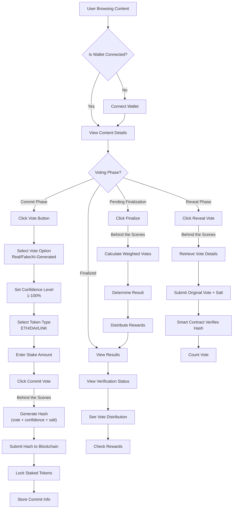
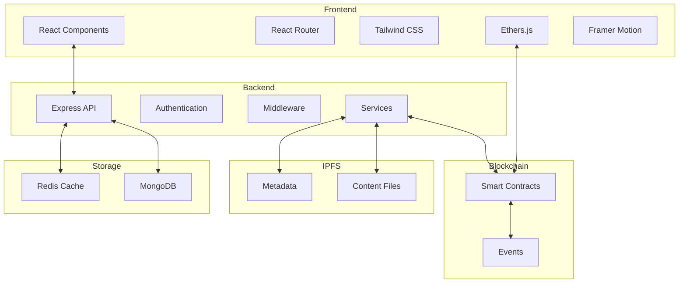

# ProofChain Demonstration Guide

## Table of Contents

1. [Introduction](#introduction)
2. [Setup & Installation](#setup--installation)
3. [Getting Started](#getting-started)
4. [Core Features](#core-features)
   - [Connecting Your Wallet](#connecting-your-wallet)
   - [Browsing Content](#browsing-content)
   - [Submitting Content](#submitting-content)
   - [Voting Process](#voting-process)
   - [User Profile](#user-profile)
5. [Behind the Scenes](#behind-the-scenes)
6. [Troubleshooting](#troubleshooting)
7. [Advanced Features](#advanced-features)

## Introduction

ProofChain is a decentralized content verification platform that uses a commit-reveal voting mechanism with multi-token support. This guide will walk you through setting up the application locally and demonstrate its core features.

### Key Features

- **Commit-Reveal Voting**: Two-phase voting system to prevent manipulation
- **Multi-Token Support**: Stake various cryptocurrencies to participate in voting
- **Decentralized Storage**: Content stored on IPFS for censorship resistance
- **Blockchain Integration**: Transparent and immutable voting records
- **Responsive Design**: Optimized for both desktop and mobile devices with dark/light theme support

## Setup & Installation

### Prerequisites

- Node.js (v14 or later)
- MongoDB (local or Atlas)
- Redis (optional)
- MetaMask or other Web3 wallet

### Step 1: Install Backend Dependencies

```bash
cd backend
npm install
```

### Step 2: Install Frontend Dependencies

```bash
cd ../frontend
npm install
```

### Step 3: Start the Backend Server

```bash
cd ../backend
npm start
```

You should see output indicating:

- Server running on port 3000
- MongoDB connection established
- Redis connection (if enabled)
- Blockchain services initialization (if enabled)

### Step 4: Start the Frontend Development Server

Open a new terminal window and run:

```bash
cd frontend
npm start
```

The frontend will start on port 5003 to avoid conflicts with the backend.

### Step 5: Access the Application

Open your browser and navigate to:

- Frontend: http://localhost:5003
- Backend API: http://localhost:3000

## Getting Started

When you first access the application, you'll see the homepage displaying a list of content items submitted for verification. The interface is designed to be intuitive and user-friendly.

### Navigation

- **Header**: Contains the application logo, navigation links, and wallet connection button
- **Main Content Area**: Displays content items or the current page content
- **Footer**: Contains links to documentation, GitHub, and other resources

### Theme Toggle

ProofChain supports both light and dark themes:

1. Look for the sun/moon icon in the header
2. Click to toggle between light and dark modes
3. Your preference will be saved for future visits

## Screenshots

### Homepage


_The homepage displays content items submitted for verification_

### Content Detail Page


_Detailed view of a content item with voting information_

### Voting Interface


_Interface for committing and revealing votes_

### User Profile


_User profile page showing reputation and voting history_

> **Note**: The actual application UI may differ slightly from these screenshots as the platform evolves.

## Core Features

### Connecting Your Wallet

Before you can submit content or participate in voting, you need to connect your Web3 wallet:

1. Click the "Connect Wallet" button in the top-right corner
2. If you have MetaMask installed, it will prompt you to connect
3. Select the account you want to use
4. Approve the connection request

**Behind the Scenes**: When you connect your wallet, the application:

- Requests access to your Ethereum address
- Creates or retrieves your user profile from the database
- Sets up listeners for blockchain events related to your address
- Establishes a secure session using JWT authentication

### Browsing Content

The homepage displays content items submitted for verification:

1. **Content Cards**: Each card represents a content item with:

   - Title and description
   - Creator address (shortened)
   - Submission date
   - Current voting phase badge
   - Time remaining in the current phase

2. **Filtering & Sorting**: Use the controls above the content list to:

   - Filter by content type (image, video, article, etc.)
   - Filter by voting phase (commit, reveal, finalized, etc.)
   - Sort by submission date, popularity, or stake amount

3. **Pagination**: Scroll down to load more content items

### Submitting Content

To submit new content for verification:

1. Ensure your wallet is connected
2. Click the "Submit New Content" button
3. Fill in the submission form:

   - Title: A descriptive title for your content
   - Description: Detailed information about your content
   - Content Type: Select the appropriate type (image, video, article, etc.)
   - Tags: Add relevant tags to categorize your content
   - File Upload: Upload the content file (image, video, document, etc.)
   - Voting Duration: Set the duration for the voting period (optional)

4. Click "Submit" to initiate the submission process

**Behind the Scenes**:

- The file is uploaded to IPFS for decentralized storage
- A metadata file is created and also stored on IPFS
- A transaction is sent to the blockchain to register the content
- The backend creates a database entry linking to the blockchain record
- The content enters the commit phase of voting

### Voting Process

ProofChain uses a commit-reveal voting mechanism to prevent manipulation:



#### Commit Phase

1. Navigate to a content item in the commit phase
2. Click "Vote" to open the voting interface
3. Select your vote option (Real, Fake, or AI-Generated)
4. Set your confidence level (1-100%)
5. Select the token type you want to stake
6. Enter the stake amount
7. Click "Commit Vote"

**Behind the Scenes**:

- A cryptographic hash is generated from your vote, confidence, and a random salt
- This hash is submitted to the blockchain, hiding your actual vote
- Your tokens are staked and locked until the reveal phase ends
- The backend stores your commit information securely

#### Reveal Phase

Once the commit phase ends, the reveal phase begins:

1. Navigate to a content item in the reveal phase
2. Click "Reveal Vote"
3. The system will automatically retrieve your vote details
4. Confirm the reveal transaction

**Behind the Scenes**:

- Your original vote, confidence level, and salt are submitted to the blockchain
- The smart contract verifies that the hash matches your commit
- Your vote is counted toward the final result
- If you don't reveal your vote during this phase, you forfeit your stake

#### Finalization

After the reveal phase ends:

1. Anyone can trigger finalization by clicking "Finalize Voting"
2. The final result is determined based on the weighted votes
3. Rewards are distributed to voters who voted with the majority
4. The content's verification status is updated

**Behind the Scenes**:

- The smart contract calculates the weighted vote totals
- Tokens are distributed to winning voters proportional to their stake and confidence
- The content's status is updated in both the blockchain and the database
- Events are emitted that update the UI automatically

### User Profile

To view and manage your profile:

1. Click on your address in the header after connecting your wallet
2. The profile page displays:
   - Your account information
   - Reputation score
   - Voting history
   - Token balances
   - Content submissions

## Behind the Scenes

### Technical Architecture

ProofChain consists of several interconnected components:



1. **Frontend**: React application with:

   - React Router for navigation
   - Tailwind CSS for styling
   - Framer Motion for animations
   - Ethers.js for blockchain interaction

2. **Backend**: Node.js/Express API with:

   - MongoDB for database storage
   - Redis for caching
   - JWT for authentication
   - Middleware for validation, rate limiting, and error handling

3. **Blockchain**: Smart contracts for:

   - Content registration
   - Commit-reveal voting
   - Token staking and rewards
   - Reputation tracking

4. **IPFS**: Decentralized storage for:
   - Content files
   - Metadata
   - Proof records

### Data Flow

1. **Content Submission**:

   ```
   User → Frontend → Backend → IPFS → Blockchain → Database
   ```

2. **Commit Vote**:

   ```
   User → Frontend → Generate Hash → Backend → Blockchain → Database
   ```

3. **Reveal Vote**:

   ```
   User → Frontend → Backend → Blockchain → Database
   ```

4. **Content Retrieval**:
   ```
   Database → Backend → Frontend → User
                 ↑
           IPFS & Blockchain
   ```

## Troubleshooting

### Common Issues

1. **Wallet Connection Failed**

   - Ensure MetaMask is installed and unlocked
   - Check that you're on a supported network
   - Try refreshing the page

2. **Transaction Errors**

   - Check that you have enough ETH for gas fees
   - Ensure you have the tokens you're trying to stake
   - Verify that you're connected to the correct network

3. **Content Not Loading**

   - Check your internet connection
   - Ensure the backend server is running
   - Clear your browser cache

4. **API Connection Issues**
   - Verify the backend server is running on port 3000
   - Check for CORS issues in the browser console
   - Ensure the API base URL is correctly configured

### Getting Help

If you encounter issues not covered in this guide:

- Check the console for error messages
- Review the project README files
- Submit an issue on GitHub

## Advanced Features

### Multi-Token Support

ProofChain supports multiple token types for staking:

1. **Supported Tokens**:

   - ETH (Ethereum)
   - DAI (Stablecoin)
   - LINK (Chainlink)
   - Custom tokens can be added by administrators

2. **Token Conversion**:
   - All tokens are converted to USD value for vote weight calculation
   - Current prices are fetched from oracles
   - This ensures fair voting regardless of token volatility

### Reputation System

Users build reputation based on their voting history:

1. **Reputation Score**:

   - Increases when you vote with the majority
   - Decreases when you vote against the majority
   - Higher stakes and confidence levels have more impact

2. **Benefits of High Reputation**:
   - Access to exclusive features
   - Higher voting weight in certain scenarios
   - Reduced fees for content submission

### Merkle Proofs

For certain operations, merkle proofs are used to verify eligibility:

1. **How It Works**:

   - The backend generates a merkle tree of eligible addresses
   - The root hash is stored in the smart contract
   - Users provide a proof that their address is in the tree
   - The contract verifies the proof without needing the full list

2. **Use Cases**:
   - Airdrops
   - Whitelist verification
   - Special voting events

---

This guide covers the essential aspects of using ProofChain. As the platform evolves, new features and improvements will be added to enhance the user experience and expand functionality.

For developers interested in contributing to the project, please refer to the technical documentation and codebase on GitHub.

Happy verifying!

## Quick Reference

### Important URLs

- Frontend: http://localhost:5003
- Backend API: http://localhost:3000
- API Documentation: http://localhost:3000/api-docs (if enabled)

### Key Commands

```bash
# Start backend server
cd backend
npm start

# Start frontend development server
cd frontend
npm start

# Run backend tests
cd backend
npm test

# Build frontend for production
cd frontend
npm run build
```

### Common API Endpoints

- `GET /api/content` - List content items
- `GET /api/content/:id` - Get content details
- `POST /api/content` - Submit new content
- `GET /api/users/:address` - Get user profile
- `GET /api/tokens` - List supported tokens

### Keyboard Shortcuts

- `Ctrl+K` or `Cmd+K` - Open search
- `Esc` - Close modals
- `T` - Toggle theme (when not in input field)

---

_This guide is maintained by the ProofChain team. Last updated: July 2023._
