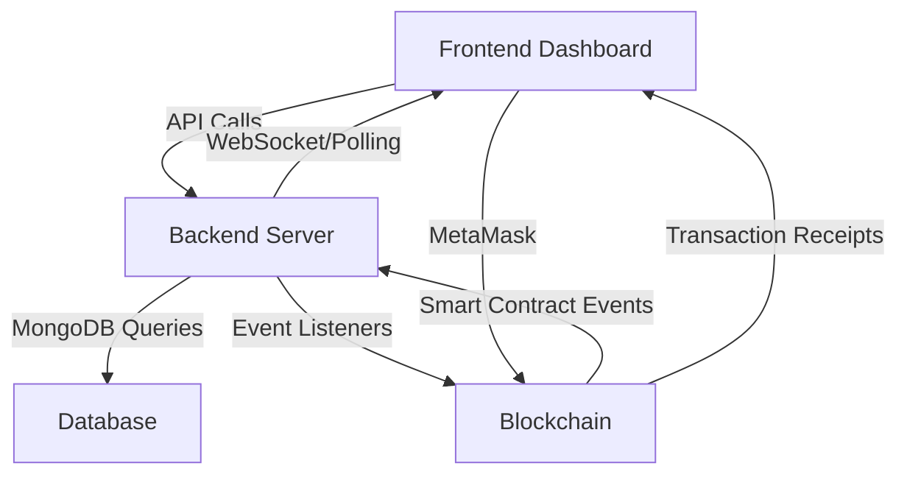

# 🔗 ProofChain - Complete System Architecture & User Journey Guide

> **A comprehensive behind-the-scenes guide to understanding ProofChain's decentralized content verification platform**

## 📋 Table of Contents
1. [System Overview](#system-overview)
2. [Architecture Components](#architecture-components)
3. [User Journey Walkthrough](#user-journey-walkthrough)
4. [Behind the Scenes Process](#behind-the-scenes-process)
5. [Contract-Hardhat Scripts Explained](#contract-hardhat-scripts-explained)
6. [Frontend-Backend-Blockchain Interaction](#frontend-backend-blockchain-interaction)
7. [Reward Claiming Process](#reward-claiming-process)
8. [Technical Diagrams](#technical-diagrams)

---

## 🎯 System Overview

ProofChain is a **decentralized content verification platform** that uses blockchain technology, community consensus, and economic incentives to determine the authenticity of digital content. The system operates on a **simple voting mechanism** with **quadratic staking** to prevent whale dominance.

### Core Principles
- **Decentralized Verification**: No single authority controls truth verification
- **Economic Incentives**: Users stake tokens to vote and earn rewards for correct consensus
- **Quadratic Voting**: Voting power increases with square root of stake amount
- **48-Hour Security Delay**: Prevents manipulation and allows dispute resolution
- **Multi-Token Support**: ETH, USDFC, FIL, and other tokens supported

---

## 🏗️ Architecture Components

### 1. **Frontend (React.js)**
```
Port: 5003
Location: /frontend/
Technology: React 18+, Tailwind CSS, Framer Motion
```

**Key Components:**
- **HomePage**: Landing page with system overview
- **ConsensusDashboard**: Real-time voting interface and content display
- **VotingInterface**: Token staking and vote submission
- **VotingResults**: Results display after voting period ends
- **WalletConnect**: MetaMask integration for blockchain interaction

### 2. **Backend (Node.js/Express)**
```
Port: 3000
Location: /backend/
Technology: Node.js, Express, MongoDB, Redis
```

**Key Services:**
- **consensusService.js**: Quadratic voting calculations
- **blockchainService.js**: Smart contract interaction
- **ipfsService.js**: Pinata IPFS integration
- **tokenService.js**: Multi-token support management
- **statusUpdateService.js**: Auto-status updates for expired content

### 3. **Smart Contracts (Solidity/Hardhat)**
```
Port: 8545 (Local Hardhat Network)
Location: /contracts-hardhat/
Technology: Solidity 0.8+, Hardhat, Chainlink Oracles
```

**Main Contracts:**
- **ProofChainSimpleVoting.sol**: Core voting logic with quadratic staking
- **MockAggregatorV3.sol**: Price oracle for USD conversion
- **MockUSDFC.sol**: Test token for development

---

## 🚀 User Journey Walkthrough

### Phase 1: Project Setup & Localhost Deployment

#### Step 1: Initial Setup
```bash
# Clone repository
git clone <repository-url>
cd proofchain

# Install dependencies for all components
npm install                    # Root dependencies
cd backend && npm install      # Backend dependencies
cd ../frontend && npm install  # Frontend dependencies
cd ../contracts-hardhat && npm install  # Contract dependencies
```

#### Step 2: Environment Configuration
```bash
# Backend environment setup
cp backend/.env.example backend/.env
# Configure MongoDB, Redis, Pinata IPFS settings

# Frontend environment setup  
cp frontend/.env.example frontend/.env
# Configure API endpoints and contract addresses

# Contracts environment setup
cp contracts-hardhat/.env.example contracts-hardhat/.env
# Configure deployment settings and private keys
```

### Phase 2: Blockchain Deployment (contracts-hardhat folder)

#### Why Run Scripts in contracts-hardhat?
The contracts-hardhat folder contains the **blockchain infrastructure** that powers the entire ProofChain system. These scripts deploy and configure the smart contracts that handle:
- **Content submission** with IPFS hash storage
- **Token staking** and vote recording
- **Quadratic voting** weight calculations
- **Consensus determination** and result finalization
- **Reward distribution** after 48-hour delay

#### Script Execution Sequence:

**Step 1: Generate Merkle Tree Data**
```bash
cd contracts-hardhat
npm run step1:merkle
```
**What happens behind the scenes:**
- Generates cryptographic merkle tree for user eligibility
- Creates whitelist of authorized voters
- Prevents Sybil attacks and unauthorized participation
- Outputs merkle root hash for contract deployment

**Step 2: Deploy Mock Price Oracle**
```bash
npm run step2:aggregator
```
**What happens behind the scenes:**
- Deploys MockAggregatorV3 contract for price feeds
- Sets initial ETH/USD price (e.g., $2000)
- Enables USD-based quadratic voting calculations
- Required for cross-token voting fairness

**Step 3: Deploy Main ProofChain Contract**
```bash
npm run step3:contract
```
**What happens behind the scenes:**
- Deploys ProofChainSimpleVoting contract
- Initializes with merkle root from Step 1
- Sets up voting parameters (minimum duration, etc.)
- Creates event listeners for frontend/backend integration

**Step 4: Activate Token Support**
```bash
npm run step4:activate-eth    # Enable ETH voting
npm run step5:activate-usdfc  # Enable USDFC voting (optional)
npm run step6:activate-fil    # Enable FIL voting (optional)
```
**What happens behind the scenes:**
- Registers token contracts with the voting system
- Links price oracles for USD conversion
- Sets minimum stake amounts and bonus multipliers
- Enables multi-token voting functionality

**Step 5: Test Deployment**
```bash
npm run test:localhost
```
**What happens behind the scenes:**
- Verifies all contracts are deployed correctly
- Tests price oracle functionality
- Confirms token activation status
- Validates merkle tree integration

### Phase 3: System Startup

#### Backend Startup Process
```bash
cd backend
npm start
```
**Behind the scenes:**
1. **Database Connection**: Connects to MongoDB for content storage
2. **Redis Initialization**: Sets up caching for performance
3. **Blockchain Service**: Initializes contract event listeners
4. **Token Service**: Loads supported token configurations
5. **API Routes**: Exposes REST endpoints for frontend
6. **Event Listeners**: Monitors blockchain for ContentSubmitted, VoteSubmitted events

#### Frontend Startup Process
```bash
cd frontend
npm start
```
**Behind the scenes:**
1. **React App**: Loads main application components
2. **Wallet Context**: Initializes MetaMask connection state
3. **Theme System**: Sets up dark/light mode toggle
4. **API Client**: Configures backend communication
5. **Blockchain Utils**: Prepares contract interaction functions

### Phase 4: User Interaction Flow

#### 4.1 Content Submission Journey

**Frontend Process:**
1. User navigates to `/submit` page
2. Fills content form (title, description, file upload)
3. Selects voting duration (minimum 1 hour)
4. Clicks "Submit Content"

**Behind the Scenes:**
```
Frontend → IPFS Upload → Backend API → Blockchain Contract
```

**Detailed Flow:**
1. **File Upload**: Content uploaded to Pinata IPFS
2. **Metadata Creation**: IPFS hash and metadata generated
3. **Backend Validation**: Voting duration and content validated
4. **Blockchain Transaction**: `submitContent()` called on smart contract
5. **Event Emission**: `ContentSubmitted` event fired
6. **Database Storage**: Content saved to MongoDB via event listener
7. **Frontend Update**: User redirected to dashboard with new content

#### 4.2 Voting Process Journey

**Frontend Process:**
1. User sees content in Consensus Dashboard
2. Clicks "Vote" button on content card
3. Voting modal opens with options:
   - Vote choice: Real/Fake
   - Confidence level: 1-10
   - Token type: ETH/USDFC/FIL
   - Stake amount: Minimum required amount

**Behind the Scenes:**
```
MetaMask Transaction → Smart Contract → Backend Recording → Frontend Update
```

**Detailed Flow:**
1. **MetaMask Prompt**: User approves blockchain transaction
2. **Token Staking**: Specified amount locked in smart contract
3. **Weight Calculation**: Quadratic formula applied: `weight = sqrt(usdValue) * confidence`
4. **Vote Recording**: Vote stored on blockchain with timestamp
5. **Event Emission**: `VoteSubmitted` event fired
6. **Backend Sync**: Vote data synchronized to MongoDB
7. **Dashboard Update**: Real-time vote counts updated

#### 4.3 Results Phase Journey

**Automatic Transition (24 hours after submission):**
1. **Status Check**: Backend service monitors voting deadlines
2. **Phase Transition**: Content status changes from "voting" to "results"
3. **Results Button**: "View Results" button appears on content cards

**User Views Results:**
1. User clicks "View Results" button
2. Results modal displays:
   - Final verdict: REAL/FAKE
   - Confidence percentage
   - Vote distribution
   - Participant count
   - Total USD staked

**Behind the Scenes:**
```
Quadratic Calculation → Consensus Determination → Confidence Scoring
```

**Detailed Calculation:**
1. **Vote Aggregation**: All votes collected with their quadratic weights
2. **Consensus Formula**: 
   ```javascript
   realWeight = sum(sqrt(stakeUSD) * confidence) for REAL votes
   fakeWeight = sum(sqrt(stakeUSD) * confidence) for FAKE votes
   totalWeight = realWeight + fakeWeight
   confidence = (maxWeight / totalWeight) * 100
   verdict = realWeight > fakeWeight ? "REAL" : "FAKE"
   ```
3. **Result Storage**: Final results cached for performance

---

## ⏰ Reward Claiming Process (48-Hour Delay)

### Why 48-Hour Delay?
The 48-hour delay serves multiple security purposes:
- **Dispute Resolution**: Time for community to challenge results
- **Manipulation Prevention**: Prevents last-minute vote manipulation
- **System Stability**: Allows for proper consensus validation
- **Economic Security**: Reduces flash attack incentives

### Reward Claiming Timeline

```
Content Submission → 24h Voting → 48h Security Delay → Reward Claiming
     T+0h              T+24h           T+72h              T+72h+
```

#### Phase 1: Voting Period (0-24 hours)
- Users can submit votes with token stakes
- Real-time vote counting and weight calculation
- No results visible to prevent bias

#### Phase 2: Results Available (24-72 hours)
- Voting ends, results calculated and displayed
- Users can view consensus outcome
- Rewards calculated but not yet claimable
- **Status**: "Results Available - Rewards Pending"

#### Phase 3: Reward Claiming (72+ hours)
- Security delay expires
- Winners can claim their rewards
- Losers forfeit their stakes
- **Status**: "Rewards Claimable"

### Reward Distribution Logic

**Winner Calculation:**
```javascript
// Users who voted with the winning consensus
const winners = votes.filter(vote => vote.choice === winningVerdict);

// Total stake from losing side becomes reward pool
const rewardPool = losingStakes.reduce((sum, stake) => sum + stake.usdValue, 0);

// Proportional distribution based on quadratic weight
winners.forEach(winner => {
  const proportion = winner.quadraticWeight / totalWinningWeight;
  const reward = (rewardPool * proportion) + winner.originalStake;
  // Transfer reward to winner's wallet
});
```

---

## 🔄 Frontend-Backend-Blockchain Interaction

### Real-Time Data Flow



### Key Integration Points

#### 1. Content Synchronization
- **Blockchain Events**: `ContentSubmitted` events trigger database updates
- **IPFS Integration**: Content metadata stored on IPFS, hash on blockchain
- **Status Updates**: Automated status transitions based on timestamps

#### 2. Vote Synchronization
- **Dual Recording**: Votes recorded both on blockchain and database
- **Weight Calculation**: Quadratic weights calculated in backend service
- **Real-time Updates**: Dashboard updates every 30 seconds

#### 3. Results Calculation
- **Blockchain Source**: Final results calculated from blockchain data
- **Backend Caching**: Results cached for performance
- **Frontend Display**: Results formatted for user-friendly display

---

## 📊 Technical Diagrams

### System Architecture Diagram

```
┌─────────────────────────────────────────────────────────────────┐
│                        ProofChain System                        │
├─────────────────┬─────────────────┬─────────────────────────────┤
│    Frontend     │     Backend     │        Blockchain           │
│   (React.js)    │   (Node.js)     │      (Solidity)             │
│                 │                 │                             │
│ ┌─────────────┐ │ ┌─────────────┐ │ ┌─────────────────────────┐ │
│ │ Dashboard   │ │ │ API Server  │ │ │ ProofChainSimpleVoting  │ │
│ │ Components  │ │ │             │ │ │ Contract                │ │
│ └─────────────┘ │ └─────────────┘ │ └─────────────────────────┘ │
│                 │                 │                             │
│ ┌─────────────┐ │ ┌─────────────┐ │ ┌─────────────────────────┐ │
│ │ Voting      │ │ │ Consensus   │ │ │ MockAggregatorV3        │ │
│ │ Interface   │ │ │ Service     │ │ │ (Price Oracle)          │ │
│ └─────────────┘ │ └─────────────┘ │ └─────────────────────────┘ │
│                 │                 │                             │
│ ┌─────────────┐ │ ┌─────────────┐ │ ┌─────────────────────────┐ │
│ │ MetaMask    │ │ │ Blockchain  │ │ │ Token Contracts         │ │
│ │ Integration │ │ │ Service     │ │ │ (ETH, USDFC, FIL)       │ │
│ └─────────────┘ │ └─────────────┘ │ └─────────────────────────┘ │
└─────────────────┴─────────────────┴─────────────────────────────┘
                  │                 │
                  ▼                 ▼
            ┌─────────────┐   ┌─────────────┐
            │  MongoDB    │   │    IPFS     │
            │  Database   │   │  (Pinata)   │
            └─────────────┘   └─────────────┘
```

### User Journey Flow Diagram

```
┌─────────────┐    ┌─────────────┐    ┌─────────────┐    ┌─────────────┐
│   Setup     │    │   Deploy    │    │   Submit    │    │    Vote     │
│  Project    │───▶│ Contracts   │───▶│  Content    │───▶│ on Content  │
│             │    │             │    │             │    │             │
└─────────────┘    └─────────────┘    └─────────────┘    └─────────────┘
                                                                │
┌─────────────┐    ┌─────────────┐    ┌─────────────┐           │
│   Claim     │    │   Wait 48h  │    │    View     │◀──────────┘
│  Rewards    │◀───│   Delay     │◀───│   Results   │
│             │    │             │    │             │
└─────────────┘    └─────────────┘    └─────────────┘
```

### Voting Process Flow

```
User Clicks Vote
        │
        ▼
┌─────────────────┐
│ Voting Modal    │
│ Opens           │
└─────────────────┘
        │
        ▼
┌─────────────────┐
│ User Selects:   │
│ • Vote Choice   │
│ • Confidence    │
│ • Token Type    │
│ • Stake Amount  │
└─────────────────┘
        │
        ▼
┌─────────────────┐
│ MetaMask        │
│ Transaction     │
│ Prompt          │
└─────────────────┘
        │
        ▼
┌─────────────────┐
│ Smart Contract  │
│ Records Vote    │
│ with Quadratic  │
│ Weight          │
└─────────────────┘
        │
        ▼
┌─────────────────┐
│ Backend Syncs   │
│ Vote Data to    │
│ Database        │
└─────────────────┘
        │
        ▼
┌─────────────────┐
│ Frontend        │
│ Updates         │
│ Dashboard       │
└─────────────────┘
```

---

## 🎯 Key Takeaways

### For New Contributors:
1. **Start with contracts-hardhat**: Deploy blockchain infrastructure first
2. **Understand the flow**: Content → Voting → Results → Rewards
3. **Follow the timeline**: 24h voting + 48h delay = 72h total cycle
4. **Test locally**: Use Hardhat network for development

### For Users:
1. **Connect MetaMask**: Required for all blockchain interactions
2. **Stake wisely**: Higher stakes = more voting power (quadratically)
3. **Vote confidently**: Confidence level affects your voting weight
4. **Wait patiently**: 48-hour delay ensures system security

### For Developers:
1. **Event-driven architecture**: Blockchain events trigger backend updates
2. **Quadratic voting**: Prevents whale dominance in consensus
3. **Multi-token support**: Flexible staking options for users
4. **IPFS integration**: Decentralized content storage

---

## 🔧 Troubleshooting Common Issues

### Contract Deployment Issues
```bash
# If deployment fails, check:
1. Hardhat node is running: npm run node
2. Environment variables are set correctly
3. Private key has sufficient ETH balance
4. Network configuration matches
```

### Frontend Connection Issues
```bash
# If MetaMask connection fails:
1. Check network is set to localhost (Chain ID: 31337)
2. Import test account from Hardhat node
3. Verify contract addresses in .env file
4. Clear browser cache and MetaMask data
```

### Backend API Issues
```bash
# If API calls fail:
1. Verify MongoDB connection
2. Check Redis server status
3. Confirm environment variables
4. Review backend logs for errors
```

---

**This completes the comprehensive guide to understanding ProofChain's architecture and user journey. The system demonstrates how blockchain technology can create trustless, incentivized content verification through community consensus.**